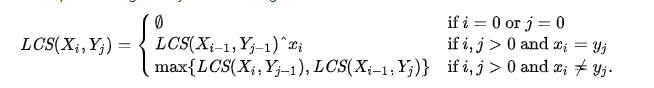

## 数据结构

### 数组

#### 数组扁平化

##### 循环递归

``` bash
function flatten(arr) {
  let result = []
  for (let i = 0; i < arr.length; i++) {
    if (Array.isArray(arr[i])) {
      result = result.concat(flatten(arr[i]))
    } else {
      result.push(arr[i])
    }
  }
  return result
}
```

##### toString

``` bash
function flatten(arr) {
  return arr.toString().split(',').map((item) => {
    return +item
  })
}
```

##### reduce

``` bash
function flatten(arr) {
  return arr.reduce((pre, cur) => {
    return pre.concat(Array.isArray(cur) ? flatten(cur) : cur)
  }, [])
}
```

##### ES6 扩展运算符

``` bash
function flatten(arr) {
  while (arr.some((item) => Array.isArray(item))) {
    arr = [].concat(...arr)
  }
  return arr
}
```

#### 数组去重

##### 双重循环

``` bash
// 实现一：
function ArrayUnique(arr) {
  let result = []
  let isRepeat
  for (let i = 0; i < arr.length; i++) {
    isRepeat = false
    for (let j = 0; j < result.length; j++) {
      if (arr[i] === result[j]) {
        isRepeat = true
        break
      }
    }
    if (!isRepeat) {
      result.push(arr[i])
    }
  }
  return result
}

// 实现二：
function ArrayUnique(arr) {
  let result = []
  let isRepeat
  for (let i = 0; i < arr.length; i++) {
    isRepeat = false
    for (let j = i + 1; j < arr.length; j++) {
      if (arr[i] === arr[j]) {
        isRepeat = true
        break
      }
    }
    if (!esRepeat) {
      result.push(arr[i])
    }
  }
  return result
}

// 实现三：基于实现二的写法改进版
function ArrayUnique(arr) {
  let result = []
  for (let i = 0; i < arr.length; i++) {
    for (let j = i + 1; j < arr.length; j++) {
      if (arr[i] === arr[j]) {
        j = ++i
      }
    }
    result.push(arr[i])
  }
  return result
}
```

##### Array.prototype.indexOf()

``` bash
// 实现一：
function ArrayUnique(arr) {
  return arr.filter((item, index) => {
    return arr.indexOf(item) === index
  })
}

// 实现二：
function ArrayUnique(arr) {
  const result = []
  arr.forEach((item) => {
    if (result.indexOf(item) === -1) {
      result.push(item)
    }
  })
  return result
}
```

##### Array.prototype.sort()

``` bash
// 实现一：
function ArrayUnique(arr) {
  const result = []
  arr.sort()
  for (let i = 0; i < arr.length; i++) {
    if (arr[i] !== arr[j]) {
      result.push(arr[i])
    }
  }
  return result
}

// 实现二：
function ArrayUnique(arr) {
  const result = []
  for (let i = 0; i < arr.length; i++) {
    if (arr[i] !== result[result.length - 1]) {
      result.push(arr[i])
    }
  }
  return result
}
```

##### Array.prototype.includes()

``` bash
function ArrayUnique(arr) {
  const result = []
  arr.forEach((item) => {
    if (!result.includes(item)) {
      result.push(item)
    }
  })
  return result
}
```

##### Array.prototype.reduce()

``` bash
function ArrayUnique(arr) {
  return arr.sort().reduce((pre, cur) => {
    if (pre.length === 0 || pre[pre.length - 1] !== cur) {
      result.push(cur)
    }
    return pre
  }, [])
}
```

##### Map

``` bash
// 实现一：
function ArrayUnique(arr) {
  const result = []
  const map = new Map()
  for (let i = 0; i < arr.length; i++) {
    if (!map.get(arr[i])) {
      map.set(arr[i], 1)
      result.push(arr[i])
    }
  }
  return result
}

// 实现二：
function ArrayUnique(arr) {
  const map = new Map()
  return arr.filter((item) => {
    return !map.has(item) && map.set(item, 1)
  })
}
```

##### Set

``` bash
// 实现一：
function ArrayUnique(arr) {
  const set new Set(arr)
  return Array.from(set)
}

function ArrayUnique(arr) {
  return [...new Set(arr)]
}
```

### 字符串

#### 最长子序列(LCS)



##### 程序实现

``` bash
function LCS(str1, str2) {
  const rows = str1.split('')
  rows.unshift('')
  const cols = str2.split('')
  cols.unshift('')
  const m = rows.length
  const n = cols.length
  const dp = []
  for (let i = 0; i < m; i++) {
    dp[i] = []
    for (let j = 0; j < n; j++) {
      if (i === 0 || j === 0) {
        dp[i][j] = 0
        continue
      }

      if (rows[i] === cols[j]) {
        dp[i][j] = dp[i - 1][j - 1] + 1 // 对角+1
      } else {
        dp[i][j] = Math.max(dp[i - 1][j], dp[i][j - 1]) // 取左边与上边最大
      }
    }
  }
  return  dp[i - 1][j - 1] // 返回最大子序列长度
}
```

进一步简化，通过挪动位置，省去数组生成

``` bash
function LCS(str1, str2) {
  const m = str1.length
  const n = str2.length
  const dp = [new Array(n + 1).fill(0)] // 第一行全是0
  for (let i = 0; i <= m; i++) {
    dp[i] = [0] // 第一列全是0
    for (let j = 1; j <= n; j++) {
      if (str1[i - 1] === str2[j - 1]) { // 注意str1的第一个字符在第二列中，因此减1，str2同理
        dp[i][j] = dp[i - 1][j - 1] + 1
      } else {
        dp[i][j] = Math.max(dp[i - 1][j], dp[i][j - 1])
      }
    }
  }
  return dp[m][n]
}
```

#### 最长公共子串

### 算法

#### 排序

##### 冒泡排序

说明：冒泡排序是从数组的开头开始，然后和下一个元素比较，如果大于则互换，直到将最大值移到最右边，并且重复该操作直到整个序列都是有序的。

程序实现：

``` bash
function bubbleSort(arr) {
  let len = arr.length
  for (let i = 0; i < len - 1; i++) {
    for (let j = 0; j <= len - i - 1; j++) {
      if (arr[j] > arr[j + 1]) {
        [arr[j], arr[j + 1]] = [arr[j + 1], arr[j]]
      }
    }
  }
  return arr
}
```

##### 选择排序

说明：选择排序是从数组的开头开始，将第一个元素和其他元素作比较，检查完所有的元素后，最小的放在第一个位置，接下来再开始从第二个元素开始，重复以上知道序列有序。

程序实现：

``` bash
function selectSort(arr) {
  let len = arr.length
  let min
  for (let i = 0; i < len - 1; i++) {
    min = i
    for (let j = i; j < len; j++) {
      if (arr[min] > arr[j]) {
        min = j
      }
    }
    if (min !== i) {
      [arr[i], arr[min]] = [arr[min], arr[i]]
    }
  }
  return arr
}
```

##### 插入排序

说明：从数组的第二个元素开始，

##### 快速排序

##### 希尔排序

##### 堆排序

说明：选择排序是找到一个数作为参考，比它大的放在其左边，比它小的放在其右边，然后分别再对左边和右边的序列做相同的操作，直到序列都是有序的。

程序实现

``` bash
function quickSort(arr) {
  if (arr.length <= 1) {
    return arr // 递归出口
  }

  let left = []
  let right = []
  let current = arr.splice(0, 1)
  for (let i = 0; i < arr.length; i++) {
    if (arr[i] < current) {
      left.push(arr[i])
    } else {
      right.push(arr[i])
    }
  }
  return quickSort(left).concat(current, quickSort(right)) // 递归运算
}
```
