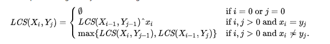

这是一篇学习算法设计的学习笔记，通过javascript实现。

<!-- more -->

## 排序

### 冒泡排序

说明：冒泡排序是从数组的开头开始，然后和下一个元素比较，如果大于则互换，直到将最大值移到最右边，并且重复该操作直到整个序列都是有序的。

程序实现：

``` bash
function bubbleSort(arr) {
  let len = arr.length
  for (let i = 0; i < len - 1; i++) {
    for (let j = 0; j <= len - i - 1; j++) {
      if (arr[j] > arr[j + 1]) {
        [arr[j], arr[j + 1]] = [arr[j + 1], arr[j]]
      }
    }
  }
  return arr
}
```

### 选择排序

说明：选择排序是从数组的开头开始，将第一个元素和其他元素作比较，检查完所有的元素后，最小的放在第一个位置，接下来再开始从第二个元素开始，重复以上知道序列有序。

程序实现：

``` bash
function selectSort(arr) {
  let len = arr.length
  let min
  for (let i = 0; i < len - 1; i++) {
    min = i
    for (let j = i; j < len; j++) {
      if (arr[min] > arr[j]) {
        min = j
      }
    }
    if (min !== i) {
      [arr[i], arr[min]] = [arr[min], arr[i]]
    }
  }
  return arr
}
```

### 插入排序

说明：插入排序是从数组的第二个元素开始，逐个与前面的元素进行比较，如果小于则进行互换位置，然后到下一个元素重复该操作，直到最后一个元素为止。

程序实现：

``` bash
function insetSort(arr) {
  let len = arr.length
  for (let i = 1; i < len - 1; i++) {
    for (let j = i; j > 0; j--) {
      if (arr[j] < arr[j - 1]) {
        [arr[j], arr[j - 1]] = [arr[j - 1], arr[j]]
      }
    }
  }
  return arr
}
```

### 快速排序

说明：快速排序是找到一个数作为参考，比它大的放在其左边，比它小的放在其右边，然后分别再对左边和右边的序列做相同的操作，直到序列都是有序的。

程序实现

``` bash
function quickSort(arr) {
  if (arr.length <= 1) {
    return arr // 递归出口
  }

  let left = []
  let right = []
  let current = arr.splice(0, 1)
  for (let i = 0; i < arr.length; i++) {
    if (arr[i] < current) {
      left.push(arr[i])
    } else {
      right.push(arr[i])
    }
  }

  return quickSort(left).concat(current, quickSort(right)) // 递归
}
```

### 希尔排序

说明：希尔排序是把记录按下标的一定增量分组，对每组使用直接插入排序算法排序；随着增量逐渐减少，每组包含的关键词越来越多，当增量减至1时，整个文件恰被分成一组，算法便终止。

程序实现：

``` bash
function shellSort(arr) {
  let len = arr.length
  let fraction = Math.floor(len / 2)
  while(fraction > 0) {
    for (let i = fraction; i < len; i++) {
      for (let j = i - fraction; j >= 0; j -= fraction) {
        if (arr[j] > arr[fraction + j]) {
          [arr[j], arr[fraction + j]] = [arr[fraction + j], arr[j]]
        }
      }
    }
    fraction = Math.floor(fraction / 2)
  }
  return arr
}
```

### 堆排序

说明：堆排序是指利用堆这种数据结构所设计的一种排序算法，通过移除位在第一个数据的根节点，并做最大堆调整的递归运算。

程序实现：

``` bash
function heapSort(arr) {
  let len = arr.length
  // 初始化，从最后一个父节点开始调整，创建最大堆
  for (let i = Math.floor(len / 2) -1; i >= 0; i--) {
    maxHeap(i, len)
  }
  console.log(arr)
  // 先从第一个元素和已排好元素前一位做交换，再进行调整
  for (let i = len - 1; i > 0; i--) {
    [arr[0], arr[i]] = [arr[i], arr[0]]
    maxHeap(0, i)
  }
  return arr

  // 最大堆函数
  function maxHeap(start, end) {
    // 建立父节点下标和子节点下标
    let dad = start
    let son = dad * 2 + 1
    if (son >= end) {
      return // 若子节点下标超过范围则返回
    }

    if (son + 1 < end && arr[son] < arr[son + 1]) {
      son++
    }
    if (arr[dad] <= arr[son]) {
      [arr[dad], arr[son]] = [arr[son], arr[dad]]
      maxHeap(son, end)
    }
  }
}
```

## 动态规划

### 最长子序列(LCS)



程序实现：

``` bash
function LCS(str1, str2) {
  const rows = str1.split('')
  rows.unshift('')
  const cols = str2.split('')
  cols.unshift('')
  const m = rows.length
  const n = cols.length
  const dp = []
  for (let i = 0; i < m; i++) {
    dp[i] = []
    for (let j = 0; j < n; j++) {
      if (i === 0 || j === 0) {
        dp[i][j] = 0
        continue
      }

      if (rows[i] === cols[j]) {
        dp[i][j] = dp[i - 1][j - 1] + 1 // 对角+1
      } else {
        dp[i][j] = Math.max(dp[i - 1][j], dp[i][j - 1]) // 取左边与上边最大
      }
    }
  }
  return  dp[i - 1][j - 1] // 返回最大子序列长度
}
```

进一步简化，通过挪动位置，省去数组生成

``` bash
function LCS(str1, str2) {
  const m = str1.length
  const n = str2.length
  const dp = [new Array(n + 1).fill(0)] // 第一行全是0
  for (let i = 0; i <= m; i++) {
    dp[i] = [0] // 第一列全是0
    for (let j = 1; j <= n; j++) {
      if (str1[i - 1] === str2[j - 1]) { // 注意str1的第一个字符在第二列中，因此减1，str2同理
        dp[i][j] = dp[i - 1][j - 1] + 1
      } else {
        dp[i][j] = Math.max(dp[i - 1][j], dp[i][j - 1])
      }
    }
  }
  return dp[m][n]
}
```

### 最长公共子串

